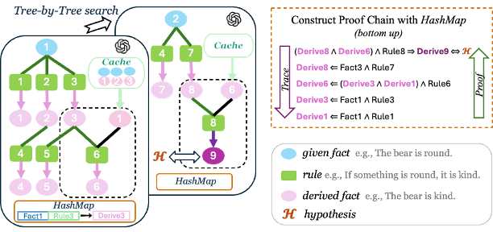

# LogicTree: Structured Proof Exploration for Coherent and Rigorous Logical Reasoning with Large Language Models

  

This is the implementation of the paper __LogicTree: Structured Proof Exploration for Coherent and Rigorous Logical Reasoning with Large Language Models__, published in EMNLP 2025 Main Conference.

__LogicTree__ is a modular framework that leverages test-time scaling to strengthen LLM reasoning. 

__Main contributions:__
- Algorithm-guided tree search for structured reasoning.
- Knowledge caching to reuse past reasoning and prevent redundancy.
- Search optimization to simplify combinatorial search into linear process.
