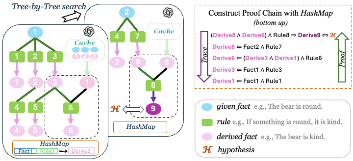

# LogicTree: Structured Proof Exploration for Coherent and Rigorous Logical Reasoning with Large Language Models

<div align="center">

[](https://arxiv.org/pdf/2504.14089)
[](https://arxiv.org/abs/2504.14089)
[](https://www.python.org/downloads/release/python-390/)

</div>

This is the implementation of the paper __LogicTree: Structured Proof Exploration for Coherent and Rigorous Logical Reasoning with Large Language Models__, published in EMNLP 2025 Main Conference.

__LogicTree__ is a modular framework that leverages test-time scaling to strengthen LLM reasoning. 

__Main contributions:__
- Algorithm-guided tree search for structured reasoning.
- Knowledge caching to reuse past reasoning and prevent redundancy.
- Search optimization to simplify combinatorial search into linear process.

A simplified overview:
<p align="center">
  
</p>

## Setup

1. Set up [OpenAI API key](https://platform.openai.com/docs/overview) and store it in the environment variable `OPENAI_API_KEY`  (in [`run.py`](run.py#L15)).

2. To run our code, please install all required packages with:
```
pip install -r requirement.txt
```

3. Our LLM prompting implementations build upon the open-source contributions from [Microsoft Guidance](https://github.com/guidance-ai/guidance).

## Run LogicTree

The runtime execution flow: [`run.py`](run.py) --> [`explore_from_root.py`](explore_from_root.py) --> [`recursion_dfs.py`](recursion_dfs.py).

Here is an example command:
```bash
python run.py \
  --llm gpt-4o \
  --spacy_model en_core_web_lg \
  --dataset proofwriter \
  --test_range 0 10 \
  --max_queries 80 \
  --double_check_deadend
```

This runs the evaluation on the *ProofWriter* dataset, using the GPT‑4o model and SpaCy’s `en_core_web_lg`, over the first 10 samples with a query limit of 80. 

The datasets are stored in [`dataset`](dataset) and the few-shot examples for each dataset are in [`prompt`](prompt) (Note: The system prompts of LLM modules vary slightly across datasets to account for dataset‑specific nuances).

## Citations
Please cite the paper and star this repo if you find LogicTree interesting/useful, thanks! Feel free to open an issue if you have any questions.

```bibtex
@article{he2025logictree,
  title={LogicTree: Structured Proof Exploration for Coherent and Rigorous Logical Reasoning with Large Language Models},
  author={He, Kang and Roy, Kaushik},
  journal={arXiv preprint arXiv:2504.14089},
  year={2025}
}
```

